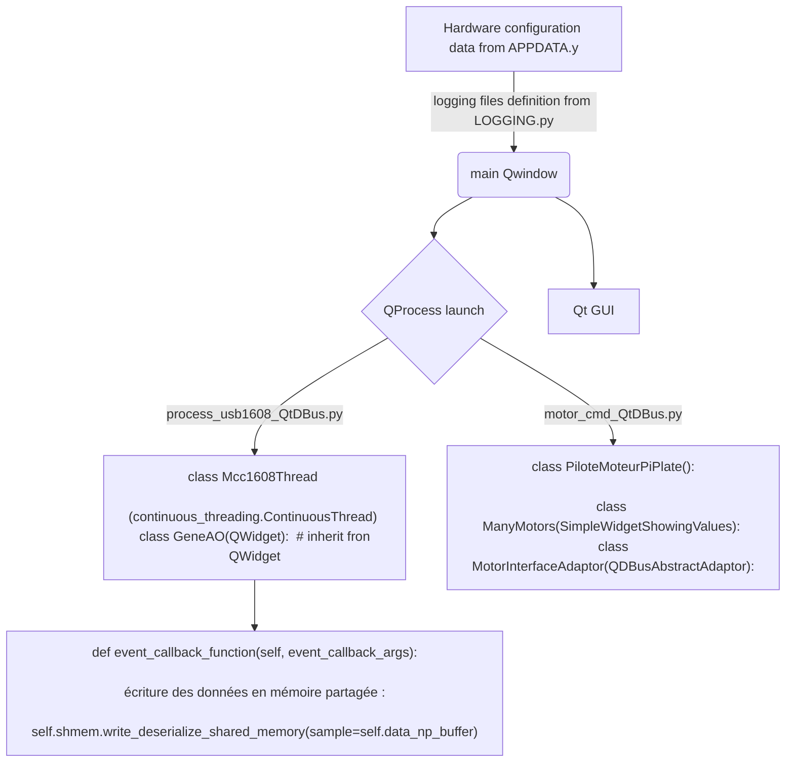

# How-to : DBus + QSharedMemory 
## Exemple de la commande des moteurs, utilisation de QDBus :

### Les paramètres sont initialisés dans .../model/APPDATA.py
``` python
motors_position = np.array([0, 0]) # positions initiales (informatique) des 2 moteurs
motors_full_datasize = len(motors_position)

IpcT = namedtuple('IPC', 'DBus shmem')  # Inter Processes Communication Tuple
QDBusInterfaceT = namedtuple("DBus", 
            "service path Interface connection")
SharedMemT = namedtuple("SharedMemory", 
                            "mode dtype mem_key index columns")
motors = IpcT(QDBusInterfaceT('org.cmd.motors',
                        '/Motors',
                        'org.cmd.MotorsInterface',
                        QDBusConnection.sessionBus()),
     {"position": SharedMemT('ReadWrite', int, 'motors_position_key', 
                    ['positions', 'butée min ?', 'butée max ?'], motors_full_datasize)})

```


### Dans le programme principal : .../main.py
``` python
class MotorsMainProcess(QDBusAbstractInterface):
    """[MotorsMainProcess cmd from main prgm]
    """
    def __init__(self, DBus,  
                 processStrName='02_motor_cmd.py', parent=None):
        super().__init__(DBus.service, DBus.path,
                            DBus.Interface, 
                            DBus.connection, parent)

        self.shmem_position = SharedMemoryForDataFrame(
                **APPDATA.motors.shmem['position']._asdict())
    def goto(self, motor, consigne):
        """sends cmd to QDBus to move one motor

        Args:
            motor (int): motor index
            consigne (int): motor consigne
        """        
        self.asyncCallWithArgumentList('goto', [motor, consigne])
    def get_position(self):
        return self.shmem_position.np_array

```

### Dans le processus (tache de fond) : .../workers/motor_cmd_QtDBus.py
Script executé dans la tache de fond de pilotage moteur :
``` python
if __name__ == '__main__':
    import motor_cmd_QtDBus as mc   # FIXME : OK but not pretty ....
    app = QtWidgets.QApplication(sys.argv)   # Qt window 

    mms = ManyMotors()

    mms_adaptor = MotorInterfaceAdaptor(mms)
    connection = QDBusConnection.sessionBus()
    connection.registerObject(APPDATA.motors.DBus.path, mms)
    connection.registerService(APPDATA.motors.DBus.service)

    sys.exit(app.exec_())   # Qt GUI for QWidget window
```

Classe de lien avec QDBus : ...MotorInterfaceAdaptor
``` python
class MotorInterfaceAdaptor(QDBusAbstractAdaptor):
    Q_CLASSINFO("D-Bus Interface",
                 APPDATA.motors.DBus.Interface)
    """Class  adaptator for QDBus
    """                 
    # Q_CLASSINFO("D-Bus Introspection", APPDATA.motors.DBus.Introspection)  # FIXME : whatfor ???
    def __init__(self, parent=None):
        super().__init__(parent)
        self.setAutoRelaySignals(True)
    @pyqtSlot(int, int)
    def goto(self, motor, consigne):
        self.parent().goto(motor, consigne)
        print(f"{consigne=} pour {motor=}")
```

## Utilisation de QSharedMemory

### Dans le processus en tache de fond ()

``` python
from AbsorptionLaser.workers.shared_memory import SharedMemoryRW
from AbsorptionLaser.workers.shared_memory import SharedMemoryForDataFrame
class ManyMotors(SimpleWidgetShowingValues):
    def __init__(self): #, parent=None):
        super().__init__()
        imax = APPDATA.PiPlate_nMotMax  # n motors on PiPlate card
        self.mots = []
        self.shmem_position = SharedMemoryForDataFrame(
                **APPDATA.motors.shmem['position']._asdict())
        for im in range(imax):
            self.mots.append(mc.PiloteMoteurPiPlate(self.shmem_position,
                                                    im=im))
    def goto(self, motor, consigne):
        self.mots[motor].goto(consigne)

```

 